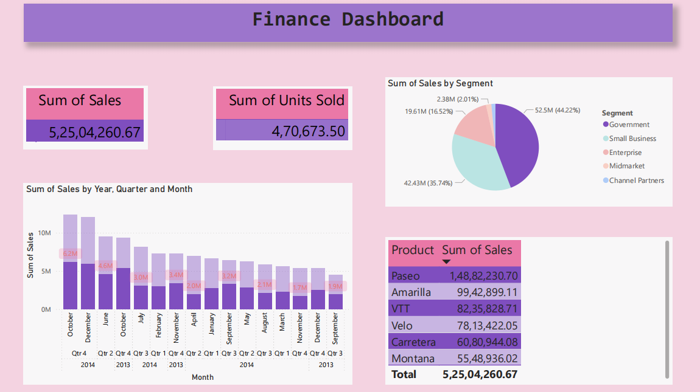
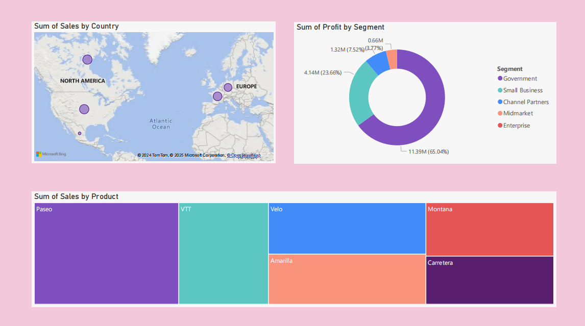
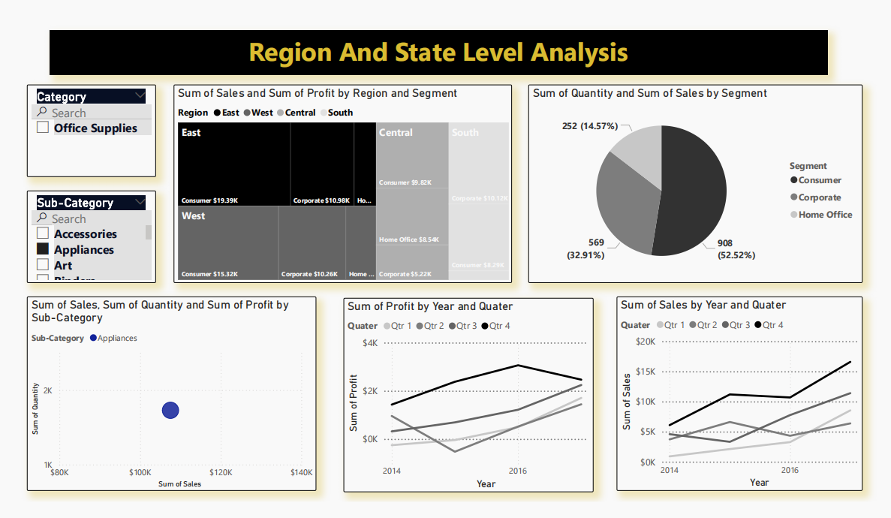
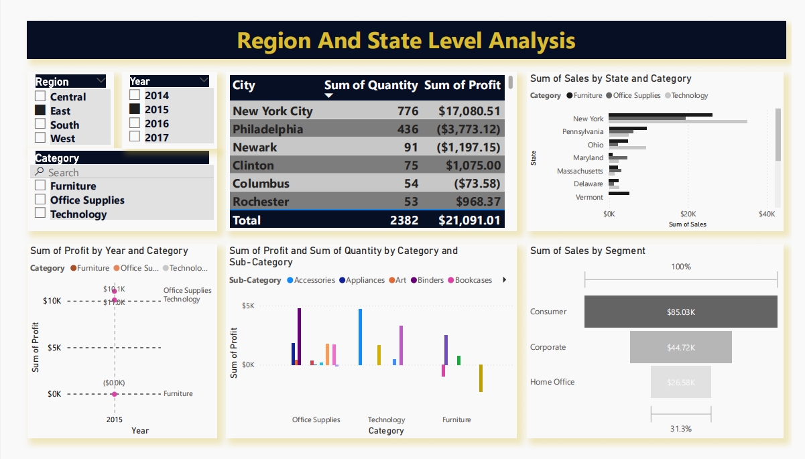
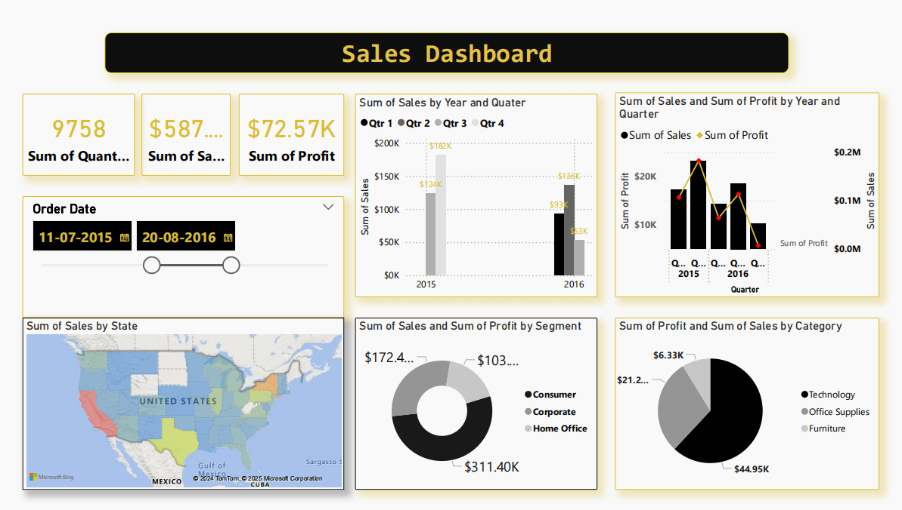

# PowerBI Analytical Dashboards

This repository contains **PowerBI analytical dashboards** created in my first year. The dashboards are designed to visualize complex datasets, providing insights through interactive charts and custom KPIs. They help in data-driven decision-making and are a demonstration of my PowerBI skills.

## Dashboards

### Finance Dashboard
This dashboard provides a comprehensive view of financial performance, including key metrics like revenue, expenses, and profit margins.

### Sales Dashboard
This dashboard tracks sales performance, analyzing trends, goals, and regional performance.

